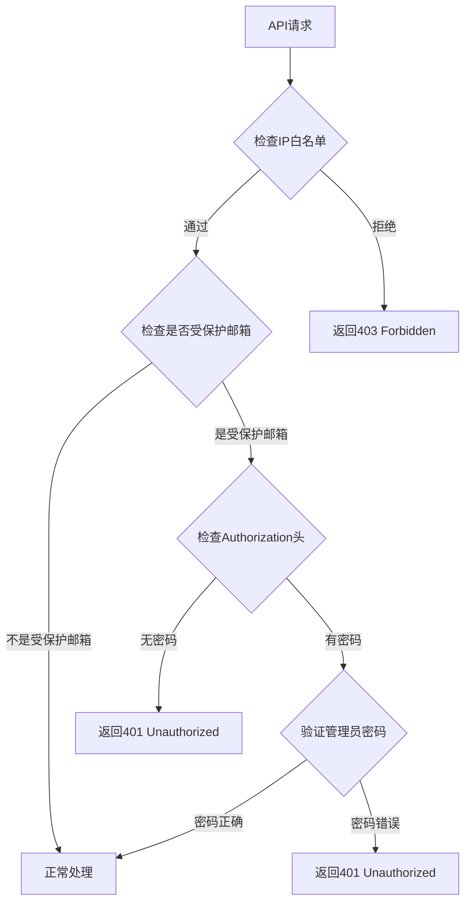

# 管理员密码认证API使用指南

## 概述

临时邮箱系统支持受保护邮箱功能，某些邮箱地址需要管理员密码才能访问。本文档详细说明如何通过API调用提供管理员密码来访问受保护邮箱。

## 管理员密码认证机制

### 1. 受保护邮箱配置

#### 1.1 环境变量配置
```python
# config.py
PROTECTED_ADDRESSES = os.getenv("PROTECTED_ADDRESSES", "^admin.*")
PASSWORD = os.getenv("PASSWORD", "password")
```

**配置说明：**
- `PROTECTED_ADDRESSES`: 正则表达式，匹配需要保护的邮箱地址
  - 默认：`"^admin.*"` - 所有以"admin"开头的邮箱
  - 示例：`"^admin.*|.*@protected\.com"` - admin开头或protected.com域名
- `PASSWORD`: 管理员密码，用于验证访问权限

#### 1.2 认证头设置
```http
Authorization: your_admin_password
```

### 2. 需要管理员密码的接口

以下接口在访问受保护邮箱时需要管理员密码：

1. **获取邮件接口**：`GET /api/get_inbox`
2. **获取邮件详情**：`GET /api/get_email`
3. **管理员登录**：`POST /api/admin_login`

## 详细使用方法

### 3. HTTP请求头认证

#### 3.1 cURL示例
```bash
# 访问受保护邮箱的邮件
curl -H "Authorization: your_admin_password" \
  "http://localhost:5000/api/get_inbox?address=admin@example.com"

# 访问受保护邮箱的特定邮件
curl -H "Authorization: your_admin_password" \
  "http://localhost:5000/api/get_email?address=admin@example.com&id=email-123"

# 管理员登录
curl -X POST http://localhost:5000/api/admin_login \
  -H "Content-Type: application/json" \
  -H "Authorization: your_admin_password" \
  -d '{"password": "your_admin_password"}'
```

#### 3.2 JavaScript示例
```javascript
// 基础认证函数
async function getInboxWithAuth(address, adminPassword) {
    try {
        const response = await fetch(`/api/get_inbox?address=${encodeURIComponent(address)}`, {
            headers: {
                'Authorization': adminPassword
            }
        });

        if (response.status === 200) {
            const emails = await response.json();
            console.log(`成功获取 ${emails.length} 封邮件`);
            return emails;
        } else if (response.status === 401) {
            throw new Error('管理员密码错误');
        } else if (response.status === 403) {
            throw new Error('IP不在白名单中');
        } else if (response.status === 410) {
            throw new Error('邮箱已过期');
        } else {
            const error = await response.json();
            throw new Error(error.error || '获取邮件失败');
        }
    } catch (error) {
        console.error('API请求失败:', error.message);
        throw error;
    }
}

// 使用示例
async function accessProtectedMailbox() {
    const adminPassword = 'your_admin_password'; // 从安全的地方获取
    const protectedAddress = 'admin@example.com';

    try {
        const emails = await getInboxWithAuth(protectedAddress, adminPassword);
        console.log('受保护邮箱邮件:', emails);
    } catch (error) {
        console.error('访问失败:', error.message);
    }
}
```

#### 3.3 Python示例
```python
import requests

def get_protected_inbox(address, admin_password, base_url='http://localhost:5000'):
    """
    获取受保护邮箱的邮件列表

    Args:
        address: 邮箱地址
        admin_password: 管理员密码
        base_url: API基础URL

    Returns:
        list: 邮件列表
    """
    headers = {
        'Authorization': admin_password
    }

    try:
        response = requests.get(
            f'{base_url}/api/get_inbox',
            params={'address': address},
            headers=headers
        )

        if response.status_code == 200:
            emails = response.json()
            print(f"成功获取 {len(emails)} 封邮件")
            return emails
        elif response.status_code == 401:
            raise ValueError("管理员密码错误")
        elif response.status_code == 403:
            raise ValueError("IP不在白名单中")
        elif response.status_code == 410:
            raise ValueError("邮箱已过期")
        else:
            error_data = response.json()
            raise ValueError(f"API错误: {error_data.get('error', '未知错误')}")

    except requests.RequestException as e:
        raise ValueError(f"网络请求失败: {str(e)}")

# 使用示例
if __name__ == "__main__":
    try:
        emails = get_protected_inbox(
            address='admin@example.com',
            admin_password='your_admin_password'
        )
        print("邮件列表:", emails)
    except ValueError as e:
        print(f"错误: {e}")
```

### 4. 认证流程图



### 5. 错误处理规范

#### 5.1 认证错误码
| HTTP状态码 | 错误信息 | 说明 | 解决方法 |
|------------|----------|------|----------|
| `401` | `Unauthorized` | 管理员密码错误或缺失 | 检查Authorization头和密码 |
| `403` | `Access denied - IP not whitelisted` | IP不在白名单中 | 添加IP到白名单或联系管理员 |
| `410` | `Mailbox expired` | 邮箱已过期 | 创建新邮箱或延长过期时间 |

#### 5.2 错误处理示例
```javascript
class ProtectedMailboxClient {
    constructor(baseUrl, adminPassword) {
        this.baseUrl = baseUrl;
        this.adminPassword = adminPassword;
        this.errorHandlers = {
            401: (error) => '管理员密码错误，请检查密码',
            403: (error) => 'IP访问被拒绝，请联系管理员',
            410: (error) => '邮箱已过期，请重新创建',
            404: (error) => '邮箱不存在',
            500: (error) => '服务器内部错误，请稍后重试'
        };
    }

    async getInbox(address) {
        try {
            const response = await fetch(
                `${this.baseUrl}/api/get_inbox?address=${encodeURIComponent(address)}`,
                {
                    headers: {
                        'Authorization': this.adminPassword
                    }
                }
            );

            if (response.ok) {
                return await response.json();
            } else {
                const errorText = await response.text();
                let errorMessage = `HTTP ${response.status}`;

                if (this.errorHandlers[response.status]) {
                    errorMessage = this.errorHandlers[response.status](errorText);
                }

                throw new Error(errorMessage);
            }
        } catch (error) {
            if (error.message.includes('fetch')) {
                throw new Error('网络连接失败，请检查网络');
            }
            throw error;
        }
    }
}

// 使用示例
async function demoProtectedAccess() {
    const client = new ProtectedMailboxClient(
        'http://localhost:5000',
        'your_admin_password'
    );

    try {
        const emails = await client.getInbox('admin@example.com');
        console.log('成功获取受保护邮箱邮件:', emails);
    } catch (error) {
        console.error('访问受保护邮箱失败:', error.message);
        // 显示用户友好的错误信息
        alert(error.message);
    }
}
```

### 6. 安全最佳实践

#### 6.1 密码管理
```javascript
// ❌ 错误：硬编码密码
const ADMIN_PASSWORD = 'password123';

// ✅ 正确：环境变量或安全配置
const ADMIN_PASSWORD = process.env.ADMIN_PASSWORD || 'default_password';

// ✅ 更好：动态输入
function createProtectedClient(adminPassword) {
    return new ProtectedMailboxClient('http://localhost:5000', adminPassword);
}
```

#### 6.2 密码验证
```javascript
// 管理员密码验证函数
async function verifyAdminPassword(password, baseUrl = 'http://localhost:5000') {
    try {
        const response = await fetch(`${baseUrl}/api/admin_login`, {
            method: 'POST',
            headers: {
                'Content-Type': 'application/json',
                'Authorization': password
            },
            body: JSON.stringify({ password })
        });

        const result = await response.json();

        if (response.ok && result.success) {
            console.log('管理员密码验证成功');
            return { valid: true, message: '验证成功' };
        } else {
            return { valid: false, message: result.message || '密码错误' };
        }
    } catch (error) {
        return { valid: false, message: '验证服务不可用' };
    }
}

// 使用示例
async function authenticateAndAccess() {
    const password = prompt('请输入管理员密码:');

    if (!password) {
        alert('需要管理员密码才能访问');
        return;
    }

    // 先验证密码
    const authResult = await verifyAdminPassword(password);

    if (authResult.valid) {
        // 密码正确，创建认证客户端
        const client = new ProtectedMailboxClient('http://localhost:5000', password);
        const emails = await client.getInbox('admin@example.com');
        console.log('访问成功:', emails);
    } else {
        alert(`认证失败: ${authResult.message}`);
    }
}
```

### 7. 批量操作示例

#### 7.1 批量访问受保护邮箱
```javascript
async function batchAccessProtectedMailboxes(addresses, adminPassword) {
    const results = [];

    for (const address of addresses) {
        try {
            console.log(`正在访问受保护邮箱: ${address}`);
            const emails = await getInboxWithAuth(address, adminPassword);
            results.push({
                address,
                success: true,
                emailCount: emails.length,
                emails
            });
        } catch (error) {
            results.push({
                address,
                success: false,
                error: error.message
            });
        }

        // 添加延迟避免请求过快
        await sleep(1000);
    }

    return results;
}

// 使用示例
async function batchDemo() {
    const protectedAddresses = [
        'admin@example.com',
        'administrator@test.com',
        'root@localhost'
    ];

    try {
        const results = await batchAccessProtectedMailboxes(
            protectedAddresses,
            'your_admin_password'
        );

        console.log('批量访问结果:');
        results.forEach(result => {
            if (result.success) {
                console.log(`✅ ${result.address}: ${result.emailCount} 封邮件`);
            } else {
                console.log(`❌ ${result.address}: ${result.error}`);
            }
        });
    } catch (error) {
        console.error('批量操作失败:', error.message);
    }
}
```

### 8. 实际应用场景

#### 8.1 管理员邮箱管理
```javascript
// 管理员专用邮箱客户端
class AdminMailboxManager {
    constructor(baseUrl, adminPassword) {
        this.client = new ProtectedMailboxClient(baseUrl, adminPassword);
        this.adminAddresses = [
            'admin@example.com',
            'administrator@test.com',
            'root@localhost'
        ];
    }

    // 获取所有管理员邮箱的邮件
    async getAllAdminEmails() {
        const allEmails = [];

        for (const address of this.adminAddresses) {
            try {
                const emails = await this.client.getInbox(address);
                allEmails.push(...emails.map(email => ({
                    ...email,
                    admin_mailbox: address
                })));
            } catch (error) {
                console.error(`获取管理员邮箱 ${address} 失败:`, error.message);
            }
        }

        return allEmails;
    }

    // 监控管理员邮箱新邮件
    async monitorAdminEmails(callback) {
        const emails = await this.getAllAdminEmails();

        // 过滤未读邮件
        const unreadEmails = emails.filter(email => !email.is_read);

        if (unreadEmails.length > 0) {
            console.log(`发现 ${unreadEmails.length} 封管理员未读邮件`);
            if (callback) {
                callback(unreadEmails);
            }
        }

        return unreadEmails;
    }
}

// 使用示例
async function adminMonitoringDemo() {
    const adminManager = new AdminMailboxManager(
        'http://localhost:5000',
        'your_admin_password'
    );

    try {
        // 监控管理员邮箱
        const unreadEmails = await adminManager.monitorAdminEmails((emails) => {
            console.log('新邮件通知:', emails.map(e => e.Subject));
        });

        if (unreadEmails.length > 0) {
            console.log('需要处理的管理邮件:', unreadEmails);
        } else {
            console.log('没有新的管理员邮件');
        }
    } catch (error) {
        console.error('管理员邮箱监控失败:', error.message);
    }
}
```

### 9. 故障排除指南

#### 9.1 常见问题

**Q: 提示"Unauthorized"错误？**
```
A: 管理员密码错误或缺失
解决步骤：
1. 检查Authorization头是否正确设置
2. 确认管理员密码是否与config.PASSWORD一致
3. 验证密码是否包含特殊字符需要URL编码
```

**Q: 提示"Access denied - IP not whitelisted"？**
```
A: IP不在白名单中
解决方法：
1. 检查IP_WHITE_LIST环境变量
2. 联系管理员添加您的IP
3. 或暂时禁用IP白名单: ENABLE_IP_WHITELIST=false
```

#### 9.2 调试技巧

```javascript
// 调试模式：显示详细请求信息
class DebugProtectedClient extends ProtectedMailboxClient {
    async makeRequest(url, options = {}) {
        console.log('[DEBUG] 请求URL:', url);
        console.log('[DEBUG] 请求选项:', {
            ...options,
            headers: {
                ...options.headers,
                'Authorization': options.headers?.Authorization ? '***隐藏***' : undefined
            }
        });

        const response = await fetch(url, options);
        console.log('[DEBUG] 响应状态:', response.status);
        console.log('[DEBUG] 响应头:', Object.fromEntries(response.headers.entries()));

        const responseText = await response.text();
        console.log('[DEBUG] 响应内容:', responseText);

        if (response.headers.get('content-type')?.includes('application/json')) {
            try {
                const responseJson = JSON.parse(responseText);
                return { ...response, json: () => Promise.resolve(responseJson) };
            } catch (e) {
                console.error('[DEBUG] JSON解析失败:', e);
            }
        }

        return response;
    }
}

// 使用调试客户端
async function debugDemo() {
    const client = new DebugProtectedClient('http://localhost:5000', 'wrong_password');

    try {
        await client.getInbox('admin@example.com');
    } catch (error) {
        console.log('预期错误:', error.message);
    }
}
```

### 10. 安全注意事项

#### 10.1 密码安全
```javascript
// ❌ 错误：密码硬编码
const ADMIN_PASSWORD = 'admin123';

// ✅ 正确：环境变量
const ADMIN_PASSWORD = process.env.TEMPMail_ADMIN_PASSWORD;

// ✅ 更好：安全输入
async function securePasswordInput() {
    // 使用安全的密码输入方法
    const password = await getPasswordFromSecureStore();
    return new ProtectedMailboxClient('http://localhost:5000', password);
}
```

#### 10.2 请求安全
```javascript
// 添加超时和重试机制
class SecureProtectedClient extends ProtectedMailboxClient {
    async getInbox(address, options = {}) {
        const { timeout = 10000, retries = 3 } = options;

        for (let i = 0; i < retries; i++) {
            try {
                const controller = new AbortController();
                const timeoutId = setTimeout(() => controller.abort(), timeout);

                const response = await fetch(
                    `${this.baseUrl}/api/get_inbox?address=${encodeURIComponent(address)}`,
                    {
                        headers: {
                            'Authorization': this.adminPassword,
                            'User-Agent': 'TempMail-Client/1.0'
                        },
                        signal: controller.signal
                    }
                );

                clearTimeout(timeoutId);

                if (response.ok) {
                    return await response.json();
                } else {
                    throw new Error(`HTTP ${response.status}: ${response.statusText}`);
                }
            } catch (error) {
                if (error.name === 'AbortError') {
                    throw new Error('请求超时');
                }

                if (i === retries - 1) {
                    throw error;
                }

                console.log(`第 ${i + 1} 次尝试失败，等待重试...`);
                await sleep(1000 * (i + 1));
            }
        }
    }
}
```

## 总结

### 访问受保护邮箱的完整流程：

1. **准备管理员密码**：从安全的地方获取管理员密码
2. **设置Authorization头**：在HTTP请求中添加`Authorization: your_password`
3. **发送API请求**：调用需要认证的接口
4. **处理响应**：根据HTTP状态码处理不同情况
5. **错误处理**：提供用户友好的错误信息

### 关键要点：

- ✅ **认证头**：使用`Authorization: password`头
- ✅ **错误处理**：正确处理401、403、410等状态码
- ✅ **安全实践**：避免硬编码密码，使用环境变量
- ✅ **调试支持**：提供详细的调试和故障排除信息

通过正确使用管理员密码认证，您可以安全地访问所有受保护的邮箱资源。