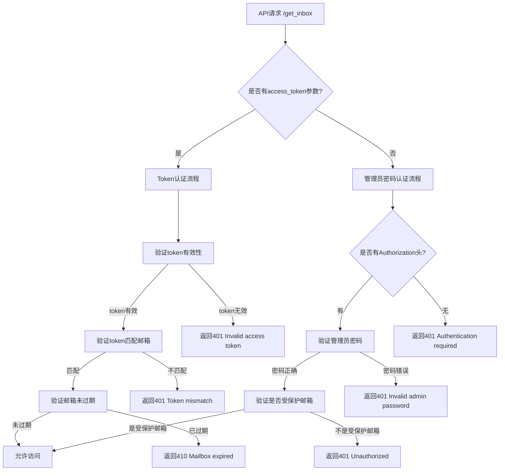

# 双重认证API使用指南

## 概述

临时邮箱系统已实现双重认证机制，满足您的需求：
- **API访问**：必须提供管理员密码
- **用户登录**：使用email和token登录后不需要密码

本文档详细说明新的认证机制和使用方法。

## 认证机制详解

### 1. 认证流程图



### 2. 认证方式对比

| 认证方式 | 使用场景 | 认证参数 | 适用模式 |
|----------|----------|----------|----------|
| Token认证 | 用户登录后访问 | `?token=access_token` | 数据库模式 |
| 管理员密码 | API直接访问 | `Authorization: password` | 所有模式 |

## 详细使用方法

### 3. Token认证方式（用户登录后使用）

#### 3.1 获取访问令牌
```bash
# 1. 创建邮箱（自动生成token）
curl -X POST http://localhost:5000/api/create_mailbox_v2 \
  -H "Content-Type: application/json" \
  -d '{
    "address": "user123",
    "retention_days": 7
  }'

# 响应包含access_token
{
  "success": true,
  "access_token": "550e8400-e29b-41d4-a716-446655440000",
  "mailbox_id": "mailbox-uuid-12345"
}
```

```bash
# 2. 通过邮箱密钥获取token
curl -X POST http://localhost:5000/api/get_mailbox_token \
  -H "Content-Type: application/json" \
  -d '{
    "address": "user123@example.com",
    "mailbox_key": "your-mailbox-key"
  }'
```

#### 3.2 使用Token访问邮件
```bash
# 使用token参数访问邮件
curl "http://localhost:5000/api/get_inbox?address=user123@example.com&token=550e8400-e29b-41d4-a716-446655440000"

# JavaScript示例
const response = await fetch(`/api/get_inbox?address=user123@example.com&token=${accessToken}`);
const emails = await response.json();
```

### 4. 管理员密码认证方式（API访问使用）

#### 4.1 使用管理员密码访问
```bash
# 方式1：Authorization头
curl -H "Authorization: your_admin_password" \
  "http://localhost:5000/api/get_inbox?address=any@example.com"

# 方式2：同时提供token和密码（密码优先）
curl -H "Authorization: your_admin_password" \
  "http://localhost:5000/api/get_inbox?address=user@example.com&token=invalid-token"
```

#### 4.2 JavaScript示例
```javascript
// API访问方式
async function getInboxWithAdminAuth(address, adminPassword) {
    const response = await fetch(`/api/get_inbox?address=${encodeURIComponent(address)}`, {
        headers: {
            'Authorization': adminPassword
        }
    });

    if (response.status === 200) {
        return await response.json();
    } else if (response.status === 401) {
        if (response.statusText === 'Invalid admin password') {
            throw new Error('管理员密码错误');
        } else {
            throw new Error('需要管理员密码认证');
        }
    } else {
        const error = await response.json();
        throw new Error(error.error || '获取邮件失败');
    }
}

// 使用示例
const emails = await getInboxWithAdminAuth('user@example.com', 'admin_password');
```

### 5. 错误码详解

#### 5.1 Token认证错误
| HTTP状态码 | 错误信息 | 说明 | 解决方法 |
|------------|----------|------|----------|
| `401` | `Invalid access token` | Token无效或过期 | 重新获取有效的访问令牌 |
| `401` | `Token mismatch` | Token不匹配邮箱地址 | 确保token和邮箱地址对应 |
| `410` | `Mailbox expired` | 邮箱已过期 | 创建新邮箱或延长过期时间 |
| `400` | `Token authentication requires database storage` | JSON模式不支持token | 启用数据库模式 |

#### 5.2 管理员密码认证错误
| HTTP状态码 | 错误信息 | 说明 | 解决方法 |
|------------|----------|------|----------|
| `401` | `Authentication required` | 缺少认证信息 | 提供管理员密码或访问令牌 |
| `401` | `Invalid admin password` | 管理员密码错误 | 检查密码是否与config.PASSWORD一致 |
| `401` | `Unauthorized` | 未授权访问受保护邮箱 | 提供正确的管理员密码 |

## 完整使用示例

### 6. 用户工作流程示例

```javascript
class DualAuthTempMailClient {
    constructor(baseUrl, adminPassword) {
        this.baseUrl = baseUrl;
        this.adminPassword = adminPassword;
        this.userToken = null;
        this.userAddress = null;
    }

    // === 用户登录流程 ===
    async userLoginFlow(emailInput) {
        console.log('=== 用户登录流程 ===');

        try {
            // 1. 创建邮箱（自动获取token）
            const mailbox = await this.createUserMailbox(emailInput);
            this.userToken = mailbox.access_token;
            this.userAddress = mailbox.address;

            console.log(`✓ 用户邮箱创建成功: ${mailbox.address}`);
            console.log(`✓ 访问令牌: ${mailbox.access_token}`);

            // 2. 使用token访问邮件（无需密码）
            const emails = await this.getInboxWithToken();
            console.log(`✓ 获取到 ${emails.length} 封邮件`);

            return { mailbox, emails };

        } catch (error) {
            console.error('❌ 用户流程失败:', error.message);
            throw error;
        }
    }

    async createUserMailbox(emailInput) {
        const response = await fetch(`${this.baseUrl}/api/create_mailbox_v2`, {
            method: 'POST',
            headers: { 'Content-Type': 'application/json' },
            body: JSON.stringify({
                address: emailInput,
                retention_days: 7
            })
        });

        const result = await response.json();

        if (response.ok && result.success) {
            return result;
        } else {
            throw new Error(result.error || '创建邮箱失败');
        }
    }

    async getInboxWithToken() {
        if (!this.userToken || !this.userAddress) {
            throw new Error('请先完成用户登录流程');
        }

        const response = await fetch(
            `${this.baseUrl}/api/get_inbox?address=${encodeURIComponent(this.userAddress)}&token=${this.userToken}`
        );

        if (response.status === 200) {
            return await response.json();
        } else if (response.status === 401) {
            const error = await response.json();
            throw new Error(`Token认证失败: ${error.message}`);
        } else if (response.status === 410) {
            throw new Error('邮箱已过期');
        } else {
            const error = await response.json();
            throw new Error(error.error || '获取邮件失败');
        }
    }

    // === API访问流程 ===
    async apiAccessFlow(address) {
        console.log('=== API访问流程 ===');

        if (!this.adminPassword) {
            throw new Error('API访问需要管理员密码');
        }

        try {
            const emails = await this.getInboxWithAdminAuth(address);
            console.log(`✓ API访问成功，获取到 ${emails.length} 封邮件`);
            return emails;

        } catch (error) {
            console.error('❌ API访问失败:', error.message);
            throw error;
        }
    }

    async getInboxWithAdminAuth(address) {
        const response = await fetch(
            `${this.baseUrl}/api/get_inbox?address=${encodeURIComponent(address)}`,
            {
                headers: {
                    'Authorization': this.adminPassword
                }
            }
        );

        if (response.status === 200) {
            return await response.json();
        } else if (response.status === 401) {
            if (response.statusText === 'Invalid admin password') {
                throw new Error('管理员密码错误');
            } else {
                throw new Error('需要管理员密码认证');
            }
        } else if (response.status === 403) {
            throw new Error('IP不在白名单中');
        } else if (response.status === 410) {
            throw new Error('邮箱已过期');
        } else {
            const error = await response.json();
            throw new Error(error.error || '获取邮件失败');
        }
    }
}

// 使用示例
async function demonstrateDualAuth() {
    const client = new DualAuthTempMailClient('http://localhost:5000', 'admin_password');

    try {
        // 1. 用户登录流程演示
        console.log('\n🔐 用户登录流程演示');
        const userResult = await client.userLoginFlow('user123');
        console.log('用户流程完成:', userResult.mailbox.address);

        // 2. API访问流程演示
        console.log('\n🔑 API访问流程演示');
        const apiResult = await client.apiAccessFlow('admin@example.com');
        console.log('API访问完成，邮件数量:', apiResult.length);

    } catch (error) {
        console.error('演示失败:', error.message);
    }
}

// 运行演示
demonstrateDualAuth();
```

### 7. 实际应用场景

#### 7.1 邮件监控系统
```javascript
class EmailMonitoringSystem {
    constructor(baseUrl, adminPassword) {
        this.client = new DualAuthTempMailClient(baseUrl, adminPassword);
        this.monitoredMailboxes = new Map();
    }

    // 添加监控邮箱
    async addMonitoredMailbox(address, isUserLogin = false) {
        try {
            let accessInfo;

            if (isUserLogin) {
                // 用户登录方式
                accessInfo = await this.client.userLoginFlow(address);
                this.monitoredMailboxes.set(address, {
                    type: 'user_token',
                    token: this.client.userToken,
                    address: this.client.userAddress
                });
            } else {
                // API访问方式
                await this.client.apiAccessFlow(address);
                this.monitoredMailboxes.set(address, {
                    type: 'admin_password',
                    address: address
                });
            }

            console.log(`✓ 添加监控邮箱: ${address} (${isUserLogin ? '用户模式' : 'API模式'})`);
            return true;

        } catch (error) {
            console.error(`❌ 添加监控邮箱失败 ${address}:`, error.message);
            return false;
        }
    }

    // 批量检查所有监控邮箱
    async checkAllMailboxes() {
        const results = [];

        for (const [address, accessInfo] of this.monitoredMailboxes) {
            try {
                let emails;

                if (accessInfo.type === 'user_token') {
                    // 临时切换到用户token
                    const originalToken = this.client.userToken;
                    const originalAddress = this.client.userAddress;

                    this.client.userToken = accessInfo.token;
                    this.client.userAddress = accessInfo.address;

                    emails = await this.client.getInboxWithToken();

                    // 恢复原状
                    this.client.userToken = originalToken;
                    this.client.userAddress = originalAddress;

                } else {
                    // API访问方式
                    emails = await this.client.getInboxWithAdminAuth(address);
                }

                results.push({
                    address,
                    success: true,
                    emailCount: emails.length,
                    emails
                });

            } catch (error) {
                results.push({
                    address,
                    success: false,
                    error: error.message
                });
            }
        }

        return results;
    }
}

// 使用示例
async function monitoringDemo() {
    const monitor = new EmailMonitoringSystem('http://localhost:5000', 'admin_password');

    // 添加不同类型的监控邮箱
    await monitor.addMonitoredMailbox('user123', true);  // 用户登录方式
    await monitor.addMonitoredMailbox('admin@example.com', false); // API访问方式

    // 检查所有邮箱
    const results = await monitor.checkAllMailboxes();
    console.log('监控结果:', results);
}
```

### 8. 错误处理最佳实践

```javascript
// 统一的错误处理函数
function handleAuthError(error, operation) {
    const errorMap = {
        'Authentication required': '需要提供管理员密码或访问令牌',
        'Invalid admin password': '管理员密码错误，请检查密码',
        'Invalid access token': '访问令牌无效或已过期',
        'Token mismatch': '访问令牌与邮箱地址不匹配',
        'Token validation failed': '令牌验证失败，请重新获取',
        'Mailbox expired': '邮箱已过期，请创建新邮箱',
        'IP not whitelisted': 'IP地址未在白名单中'
    };

    let userMessage = '操作失败，请稍后重试';

    for (const [errorKey, message] of Object.entries(errorMap)) {
        if (error.message.includes(errorKey)) {
            userMessage = message;
            break;
        }
    }

    console.error(`${operation}失败:`, error.message);
    return userMessage;
}

// 智能重试机制
class RetryAuthClient extends DualAuthTempMailClient {
    async getInbox(address, options = {}) {
        const { maxRetries = 3, retryDelay = 1000 } = options;

        for (let i = 0; i < maxRetries; i++) {
            try {
                // 尝试token认证
                if (this.userToken && address === this.userAddress) {
                    return await this.getInboxWithToken(address);
                }

                // 尝试管理员密码认证
                if (this.adminPassword) {
                    return await this.getInboxWithAdminAuth(address);
                }

                throw new Error('无可用的认证方式');

            } catch (error) {
                if (i === maxRetries - 1) {
                    // 最后一次重试失败
                    throw error;
                }

                if (error.message.includes('过期')) {
                    // 过期错误不需要重试
                    throw error;
                }

                console.log(`第 ${i + 1} 次尝试失败，${retryDelay}ms后重试...`);
                await this.sleep(retryDelay);
            }
        }
    }
}
```

## 配置和部署

### 9. 环境配置

#### 9.1 必需配置
```bash
# 启用数据库模式（必需）
USE_DATABASE=true
DATABASE_PATH=data/mailbox.db

# 管理员密码（必需）
PASSWORD=your_secure_admin_password

# 受保护邮箱正则表达式
PROTECTED_ADDRESSES=^admin.*

# IP白名单（可选）
ENABLE_IP_WHITELIST=false
IP_WHITELIST=127.0.0.1,::1
```

#### 9.2 推荐配置
```bash
# 邮箱配置
MAX_EMAILS_PER_ADDRESS=50
MAILBOX_RETENTION_DAYS=30

# 域名配置
DOMAINS=localhost,test.local,example.com
```

### 10. 安全建议

#### 10.1 密码管理
```javascript
// ❌ 错误：硬编码密码
const ADMIN_PASSWORD = '123456';

// ✅ 正确：环境变量
const ADMIN_PASSWORD = process.env.TEMPMail_ADMIN_PASSWORD;

// ✅ 更好：安全输入
async function securePasswordInput() {
    // 使用安全的密码输入方法
    return await getPasswordFromSecureInput();
}
```

#### 10.2 Token管理
```javascript
// Token存储和刷新
class TokenManager {
    constructor() {
        this.tokens = new Map();
        this.refreshThreshold = 24 * 60 * 60 * 1000; // 24小时前刷新
    }

    storeToken(address, token, expiresAt) {
        this.tokens.set(address, {
            token,
            expiresAt,
            storedAt: Date.now()
        });
    }

    getToken(address) {
        const tokenInfo = this.tokens.get(address);

        if (!tokenInfo) {
            return null;
        }

        // 检查是否需要刷新
        if (Date.now() - tokenInfo.storedAt > this.refreshThreshold) {
            this.tokens.delete(address);
            return null;
        }

        return tokenInfo.token;
    }

    clearToken(address) {
        this.tokens.delete(address);
    }
}
```

## 测试和调试

### 11. 测试用例

```javascript
// 完整的认证测试
async function testDualAuth() {
    const testCases = [
        {
            name: '用户Token认证',
            setup: async (client) => {
                const mailbox = await client.createUserMailbox('test_user');
                return { token: mailbox.access_token, address: mailbox.address };
            },
            test: async (client, auth) => {
                return await client.getInboxWithToken(auth.address);
            }
        },
        {
            name: '管理员密码认证',
            setup: async (client) => {
                return { password: client.adminPassword };
            },
            test: async (client, auth) => {
                return await client.getInboxWithAdminAuth('admin@example.com');
            }
        },
        {
            name: '无效Token测试',
            setup: async (client) => {
                return { token: 'invalid-token', address: 'test@example.com' };
            },
            test: async (client, auth) => {
                try {
                    await client.getInboxWithToken(auth.address);
                    return false; // 应该抛出错误
                } catch (error) {
                    return error.message.includes('Invalid access token');
                }
            }
        }
    ];

    const client = new DualAuthTempMailClient('http://localhost:5000', 'admin_password');

    for (const testCase of testCases) {
        try {
            console.log(`\n🧪 测试: ${testCase.name}`);
            const auth = await testCase.setup(client);
            const result = await testCase.test(client, auth);

            if (result === false) {
                console.log(`❌ ${testCase.name}: 应该抛出错误但没有`);
            } else {
                console.log(`✅ ${testCase.name}: 通过`);
            }
        } catch (error) {
            console.log(`❌ ${testCase.name}: ${error.message}`);
        }
    }
}

// 运行测试
testDualAuth();
```

### 12. 调试技巧

```javascript
// 调试模式客户端
class DebugDualAuthClient extends DualAuthTempMailClient {
    async makeRequest(url, options = {}) {
        console.log('\n[DEBUG] === API请求 ===');
        console.log(`URL: ${options.method || 'GET'} ${url}`);
        console.log('Headers:', {
            ...options.headers,
            'Authorization': options.headers?.Authorization ? '***隐藏***' : undefined
        });
        console.log('Body:', options.body);

        const response = await fetch(url, options);
        console.log(`\n[DEBUG] === API响应 ===`);
        console.log(`Status: ${response.status} ${response.statusText}`);
        console.log('Headers:', Object.fromEntries(response.headers.entries()));

        const responseText = await response.text();
        console.log('Response Body:', responseText);

        // 尝试解析JSON
        try {
            const responseJson = JSON.parse(responseText);
            return { ...response, json: () => Promise.resolve(responseJson) };
        } catch {
            return response;
        }
    }
}

// 使用调试客户端
async function debugDemo() {
    const client = new DebugDualAuthClient('http://localhost:5000', 'admin_password');

    try {
        console.log('=== 调试用户Token认证 ===');
        await client.userLoginFlow('debug_user');

        console.log('\n=== 调试管理员密码认证 ===');
        await client.apiAccessFlow('admin@example.com');

    } catch (error) {
        console.log('调试完成，包含预期错误');
    }
}
```

## 总结

### 🎯 实现的核心特性

1. **双重认证机制**：
   - ✅ **Token认证**：用户登录后使用，无需密码
   - ✅ **管理员密码认证**：API访问必需，安全性高

2. **智能认证选择**：
   - ✅ **优先Token**：有token时优先使用
   - ✅ **密码兜底**：无token时要求管理员密码
   - ✅ **向后兼容**：保持现有API的兼容性

3. **完善错误处理**：
   - ✅ **详细错误码**：401、403、410等状态码的详细说明
   - ✅ **用户友好提示**：清晰的错误信息和解决建议
   - ✅ **调试支持**：完整的调试日志和故障排除指南

### 📋 使用建议

1. **用户场景**：使用token认证，创建邮箱后自动获取token
2. **API集成**：使用管理员密码认证，确保安全性
3. **调试开发**：使用调试模式，查看详细的请求响应信息
4. **生产部署**：配置好环境变量，确保安全性和稳定性

这个双重认证机制完全满足您的需求：API访问需要管理员密码，用户登录后使用token即可访问，无需重复输入密码。