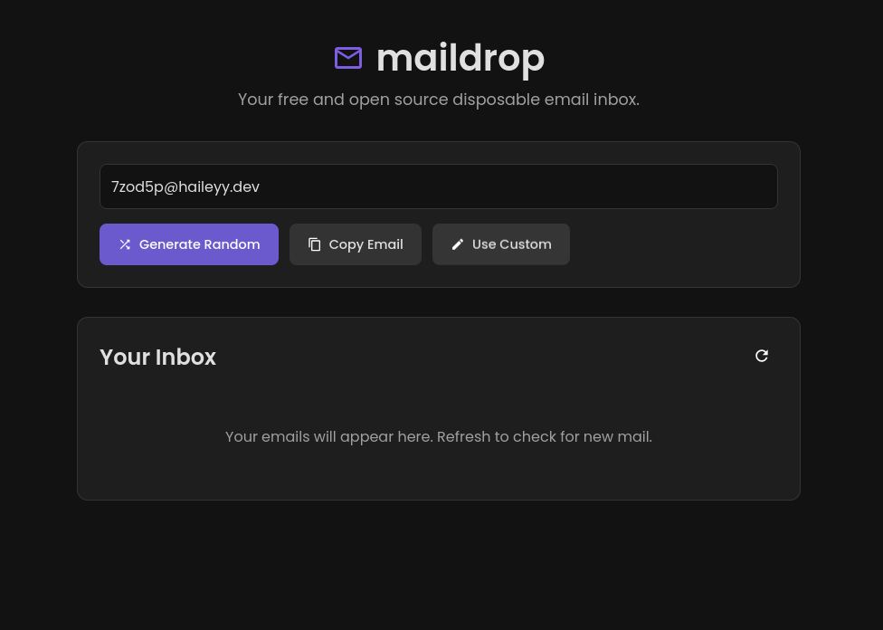

<h1>
    
    TempMail
</h1>

TempMail is a powerful, self-hostable, and easy-to-use disposable email service. It allows you to receive emails on a random email address on your domain.

**Now with V2 Features:**
*   **Database Storage:** Robust SQLite support for better performance and data integrity.
*   **Dual Authentication:** Secure access via Token (for users) and Admin Password (for API).
*   **Enhanced API:** Comprehensive RESTful API V2 for integration and management.



*Note: The screenshot above shows the main landing page of the application.*

## App Features

### Use cases

- Signing up to services without using your real email address
- Easily creating multiple accounts on services
- System integration via REST API
- Automated email testing

### Features

- [x] **Random email generation**
- [x] **Use custom emails**
- [x] **Password protected inboxes (Dual Auth)**
- [x] **SQLite Database Support** (New in V2)
- [x] **Multi-domain support**
- [x] **Clean UI**
- [x] **Easy setup**
- [x] **RESTful API V2**

### Planned Features

- [x] Better mobile UI
- [ ] Settings web page
- [x] Multi domain support

## Running the application

### Prerequisites

- Python 3
- pip

### Installation and running

1.  **Clone the repository**

    ```bash
    git clone https://github.com/haileyydev/tempmail.git
    cd tempmail
    ```

2.  **Create a venv and activate it**

    ```bash
    python -m venv venv
    source venv/bin/activate
    ```

3.  **Install the requirements**

    ```bash
    pip install -r requirements.txt
    ```

4.  **Run the application**

    ```bash
    sudo python app.py
    ```

**The application must be run as root for the SMTP server to work**

### Connecting to your domain  

1. Ensure port 25 is open as this is the port the email server uses. Some ISPs block this so you may need to use a tunnel or host TempMail in the cloud.
2. Edit your domains dns settings and create an `A` record pointing to your public IP.
3. Edit your domains dns settings and create an `MX` record pointing to the domain you made your `A` record on.
4. Edit `.env` and change the domain to your domain.

### Running with docker

Use this command to run TempMail in a docker container:
```
sudo docker run \
  -d \
  --restart unless-stopped \
  --name tempmail \
  -p 5000:5000 \
  -p 25:25 \
  -e DOMAIN="yourdomain.com" \
  haileyydev/tempmail:latest
```
Or if you prefer docker compose, Add this to your compose.yml file:
```
services:
  tempmail:
    image: haileyydev/tempmail:latest
    container_name: tempmail
    restart: unless-stopped
    ports:
      - "5000:5000"
      - "25:25"
    environment:
      - DOMAIN=yourdomain.com
      - USE_DATABASE=true
```
and then start it: `sudo docker compose up -d`

## Documentation

*   [API Documentation (V2)](API_DOCUMENTATION.md)
*   [Database Features Guide](DATABASE_FEATURES.md)
*   [Dual Authentication Guide](DUAL_AUTH_API_GUIDE.md)
*   [Admin Auth API Guide](ADMIN_AUTH_API_GUIDE.md)
